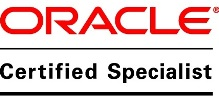

### The person who loves numbers...  

### Working as Senior Associate Manager - EPM  

## Primary Skills:
* Oracle Essbase
* Hyperion Planning
* Hyperion Planning and Cost Management  

_android is my another eye, have contributed to the custom roms world_

## My works on Android Custom Roms:
* [SlimRoms for Xiaomi mi4i](http://forum.xda-developers.com/mi-4i/development/slim-ferrari-6-0-1-alpha-0-7-unofficial-t3431751)
* [AOSP-OMS for Xiaomi mi4i](http://forum.xda-developers.com/mi-4i/development/rom-aosp-rro-t3433717)

want to know further about me? be my friend :smile:  
just click the links on left panel to add me in your friend's list..
